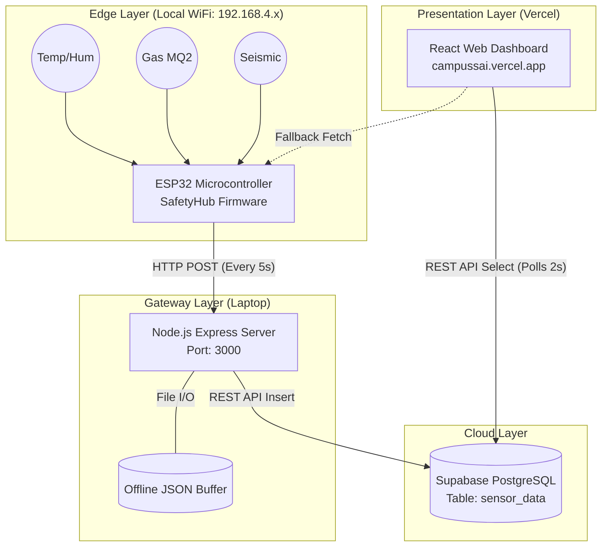
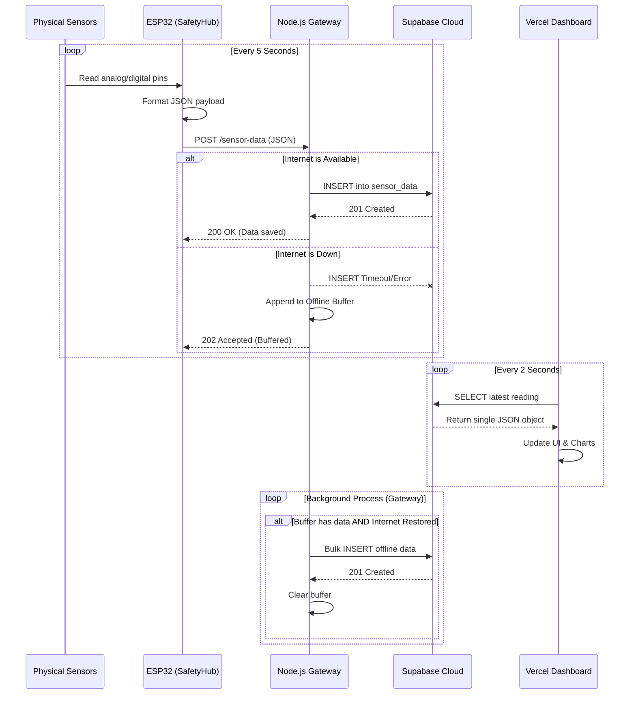

# Campus Safety Dashboard — System Architecture

This document provides a comprehensive overview of the fully operational IoT pipeline built for the Campus Safety Dashboard. It outlines the technology stack, components, and data flow from the physical sensors to the web dashboard.

## 1. High-Level Architecture

The system follows a classic decoupled IoT architecture:
- **Edge Layer:** ESP32 Microcontroller + Physical Sensors
- **Gateway Layer:** Local Node.js server running on a laptop
- **Cloud Layer:** Supabase PostgreSQL Database + REST API
- **Presentation Layer:** Next.js/Vite React Application hosted on Vercel

---

## 2. Component Details

### A. The Edge (ESP32)
- **Role:** Data collection and transmission.
- **Codebase:** `esp32/SafetyHub.ino`
- **Network:** Acts as a WiFi Access Point (`SSID: SafetyHub`).
- **Workflow:** 
  - Reads raw analog/digital data from sensors (DHT11, MQ2, MPU6050/Vibration).
  - Normalizes data into physical units (Celsius, %, ppm, G-force).
  - Connects to the Gateway IP (`192.168.4.10` or mapped `192.168.4.4`).
  - Pushes a JSON payload via `HTTP POST` every 5 seconds.
  - Maintains a local REST endpoint (`GET /api/data`) as a fallback for direct local access.

### B. The Gateway (Node.js)
- **Role:** Reliability bridge between the unstable local edge and the cloud.
- **Codebase:** `gateway-node/server.js`
- **Network:** Listens on `0.0.0.0:3000`. Bridged between local WiFi and internet (via USB tethering).
- **Workflow:**
  - Receives `POST /sensor-data` from the ESP32.
  - Validates payload structure and data types.
  - Attempts to insert the data into the Supabase `sensor_data` table.
  - **Offline Resilience:** If Supabase is unreachable (no internet), it pushes the data into an in-memory buffer (capable of holding `BUFFER_MAX_SIZE` readings).
  - Automatically flushes the offline buffer to Supabase once an internet connection is restored, ensuring zero data loss.

### C. The Database (Supabase)
- **Role:** Persistent cloud storage and historical record.
- **Codebase:** `supabase/schema.sql`
- **Schema:**
  - `id` (UUID, Primary Key)
  - `device_id` (String)
  - `temperature` (Float)
  - `humidity` (Float)
  - `gas_level` (Float)
  - `vibration` (Float)
  - `alert` (String)
  - `created_at` (Timestamp, Indexed for fast time-series queries)
- **Features:** Auto-scaling PostgreSQL instance with highly optimized built-in REST API (PostgREST).

### D. The Frontend Dashboard (React / Vite)
- **Role:** Data visualization and alerting.
- **Codebase:** `src/App.jsx`, `src/services/sensorService.js`, `src/hooks/useSensorData.js`
- **Hosting:** Deployed serverless on Vercel.
- **Workflow:**
  - Uses a custom React Hook (`useSensorData`) to poll Supabase every 2 seconds (`.order('created_at').limit(1).maybeSingle()`).
  - Adaptive UI displays a green "Live — Supabase Cloud" banner when connected.
  - Renders real-time statistics and historical charts (Analytics tab).
  - Evaluates thresholds (e.g., Gas > 800ppm) and dynamically triggers UI alerts.

---

## 3. Detailed Data Flow Sequence

This sequence diagram illustrates the step-by-step flow of a single sensor reading through the entire pipeline, including the offline buffering scenario.

## 4. Production Security & Reliability Features

1. **Gateway Rate Limiting:** Prevents the ESP32 (or malicious actors on the local network) from spamming the Supabase API. Capped at 60 requests per minute per IP.
2. **Graceful Degradation (`maybeSingle`):** The Vercel dashboard handles empty databases without crashing (fixing the `PGRST116` PostgREST error).
3. **Environment Separation:** Hardcoded API keys were removed. Supabase credentials (`SUPABASE_URL`, `SUPABASE_KEY`) are injected via Vercel Environment Variables in the cloud and local `.env` files on the Gateway.
4. **Resilient Retry Logic:** The Gateway uses an exponential backoff strategy (up to 3 retries) for Supabase inserts before falling back to the RAM buffer.
